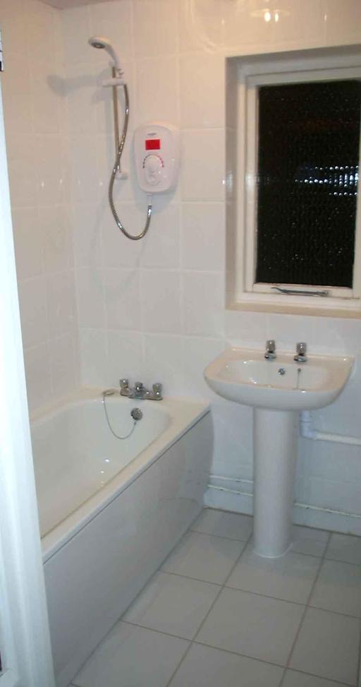
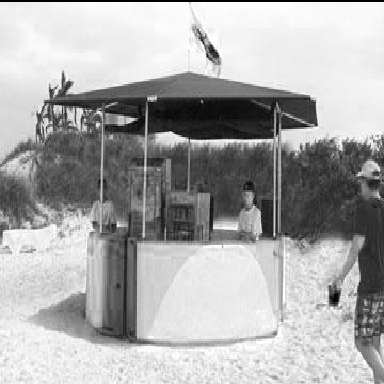
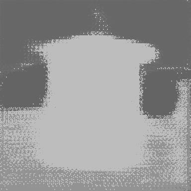
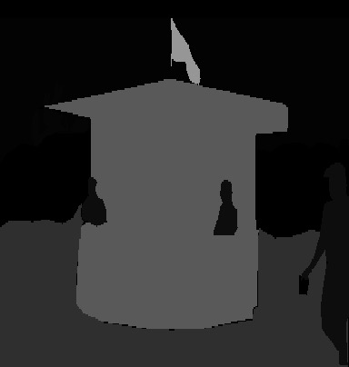
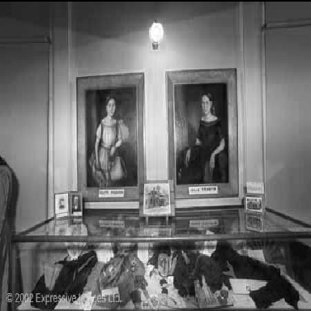
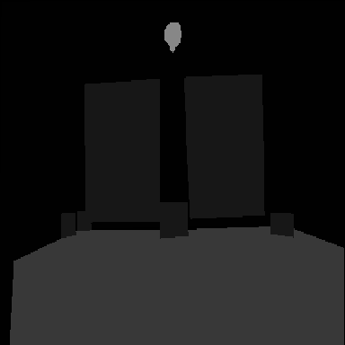

# Deep Learning

### COMSW4995 - Deep Learning

### Final Project - Scene Parsing using Image Segmentation and Semantic Labelling

## Abstract
<p>The objective is to segment and parse an image into different image regions and assign semantic labels to these regions. We use the ADEChallengeData2016 Dataset, which contains more than 20,000 scene-centric images exhaustively annotated with objects and object parts. The data set is divided into 20,000 images for training, 2,000 images for validation and another batch of held-out images for testing. Our model uses the Convolutional Neural Networks (CNNs) for their local contextual abilities and 2-D Bidirectional-Recurrent Neural Networks (Bi-RNNs) for remembering long term dependencies. The 2-D Bi-RNN architecture is implemented using 2 layers of Bi-RNNs where data is fed in horizontal slices to the first layer and the output of the first layer is fed in vertical slices to the second layer. Upsampling layers follow the CNN and RNN layers to recover the original image resolution in the final predictions. This architecture is efficient, flexible and suitable for a variety of semantic segmentation tasks.</p>

Dataset used: [ADE20K dataset](http://groups.csail.mit.edu/vision/datasets/ADE20K/)

<p> Sample Images from ADE20k</p>
<p> Sample 1</p>

<p> Annotations</p>

<p> Sample 2</p>

<p> Annotations</p>


### Steps to follow:

* Clone the repository using:
```
git clone https://github.com/siddhantsomani/DeepLearning.git
```
* Download dataset using:
```
wget http://data.csail.mit.edu/places/ADEchallenge/ADEChallengeData2016.zip
```
* Extract Dataset in the same folder as the above files(i.e, inside the cloned folder)
* Install requirements using:
```
pip install -r requirements.txt
```
* Run the model using:
```
python train.py
```

Notes:
1. Python 2.7 was used. Python 3 might throw errors.
2. Install any missing required libraries using pip. The code has been tested with the latest version of all requirements.

### Sample results from our model
<p> Sample results using Validation data</p>
<p>Sample Validation Image 1</p>

<p> Annotations from our model</p>

<p> Original Annotations</p>

<p> Sample Validation Image 2</p>

<p> Annotations from our model</p>

<p> Original Annotations</p>


### Authors

* **[Aayush Maini](https://www.github.com/amaini503)**
* **[Ishan Jain](https://www.github.com/ishankjain95)**
* **[Siddhant Somani](https://www.github.com/siddhantsomani)**

### Advisors

* **Iddo Drori**
* **Akshay Khatri**
